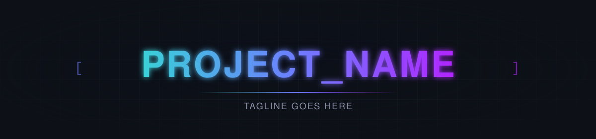

<!--
  Retargeting: replace every <angle-bracket> placeholder below. The
  badge URLs, CI workflow names, and project-structure tree already
  match this skeleton's actual layout — only the owner/repo and
  project name need swapping in those. Features, Quick Start, and
  Benchmarks are marked as sections to write fresh each time; don't
  invent numbers or content to fill them. Also edit the two <text>
  strings inside assets/banner.svg (project name + tagline).
-->

<p align="center">
  " width="100%">
</p>

<p align="center">
  /<repo>?style=for-the-badge&logo=github&color=6E40C9&labelColor=0D1117" alt="Version">
  
  
</p>

<p align="center">
  <a href="https://github.com/<owner>/<repo>/actions/workflows/build.yml">
    /<repo>/actions/workflows/build.yml/badge.svg" alt="Build and Test">
  </a>
  <a href="https://github.com/<owner>/<repo>/actions/workflows/benchmark.yml">
    /<repo>/actions/workflows/benchmark.yml/badge.svg" alt="Benchmarks">
  </a>
  <a href="https://github.com/<owner>/<repo>/actions/workflows/coverage.yml">
    /<repo>/actions/workflows/coverage.yml/badge.svg" alt="Coverage">
  </a>
  <a href="https://github.com/<owner>/<repo>/actions/workflows/sanitizers.yml">
    /<repo>/actions/workflows/sanitizers.yml/badge.svg" alt="Sanitizers">
  </a>
  <a href="https://github.com/<owner>/<repo>/actions/workflows/clang-tidy.yml">
    /<repo>/actions/workflows/clang-tidy.yml/badge.svg" alt="Clang Tidy">
  </a>
  <a href="https://github.com/<owner>/<repo>/actions/workflows/clang-format.yml">
    /<repo>/actions/workflows/clang-format.yml/badge.svg" alt="Clang Format">
  </a>
  <a href="https://github.com/<owner>/<repo>/actions/workflows/codeql.yml">
    /<repo>/actions/workflows/codeql.yml/badge.svg" alt="CodeQL">
  </a>
  <a href="https://github.com/<owner>/<repo>/actions/workflows/docs.yml">
    /<repo>/actions/workflows/docs.yml/badge.svg" alt="Documentation">
  </a>
  <a href="https://github.com/<owner>/<repo>/actions/workflows/release.yml">
    /<repo>/actions/workflows/release.yml/badge.svg" alt="Release">
  </a>
  <a href="https://github.com/<owner>/<repo>/actions/workflows/packaging.yml">
    /<repo>/actions/workflows/packaging.yml/badge.svg" alt="Packaging">
  </a>
</p>

<p align="center">
  
  
  
  
</p>

<p align="center">
  
</p>

<!-- One or two sentences: what this is, and the two or three things
     that make it worth using over the obvious alternative. This is
     the only line most visitors read — make it specific, not generic
     marketing copy. -->
<p align="center"><ProjectName> is a <one-line description of what it does and why>.</p>

<br>

## 📑 Table of Contents

- [Features](#features)
- [Requirements](#requirements)
- [Installation](#installation)
- [Quick Start](#quick-start)
- [Project Structure](#project-structure)
- [Development](#development)
- [Benchmarks](#benchmarks)
- [Documentation](#documentation)
- [Contributing](#contributing)
- [Changelog](#changelog)
- [License](#license)

<br>

## <a id="features"></a>✨ Features

<!-- Write these fresh per project — they should name the actual
     design decisions that make this implementation different, the
     way JsonPro's called out std::variant-backed storage and
     std::to_chars-based serialization rather than just "it's fast."
     A bullet that could describe any library in this category is a
     bullet worth cutting. -->

- **<Specific design decision>** — <what it is, why it matters, and
  what it avoids compared to the obvious naive approach>.
- **<Another concrete decision>** — <same pattern>.

<div align="right"><a href="#-table-of-contents"></a></div>

## <a id="requirements"></a>📋 Requirements

- A C++23-conformant compiler (tested: Clang, GCC, MSVC)
- CMake 3.20+

<div align="right"><a href="#-table-of-contents"></a></div>

## <a id="installation"></a>📦 Installation

**From source:**

```bash
git clone https://github.com/<owner>/<repo>.git
cd <repo>
cmake -B build \
  -DBUILD_TESTS=OFF \
  -DBUILD_BENCHMARKS=OFF \
  -DBUILD_REGRESSION=OFF \
  -DBUILD_EXAMPLES=OFF
cmake --install build
```

Then, in your own `CMakeLists.txt`:

```cmake
find_package(<ProjectName> CONFIG REQUIRED)
target_link_libraries(your_target PRIVATE <ProjectName>::<ProjectName>)
```

> vcpkg and Conan packages are built and verified (recipe in
> `packaging/recipes/<n>/all/`, port in `packaging/vcpkg/ports/<n>/`),
> but not yet published to the public registries. This section will be
> updated once they are.

<div align="right"><a href="#-table-of-contents"></a></div>

## <a id="quick-start"></a>🚀 Quick Start

<!-- 2–3 short, runnable examples: the most common single call, one
     example that builds something up rather than just reading it,
     and error handling if the library has anything like an exception
     hierarchy worth showing. Real code that compiles against the
     actual API — not the placeholder below. -->

```cpp
#include <ProjectName/Header.h>

int main() {
    // ...
}
```

<div align="right"><a href="#-table-of-contents"></a></div>

## <a id="project-structure"></a>🗂️ Project Structure

<details>
<summary>Expand full tree</summary>

```
<repo>/
├── include/
│   └── <ProjectName>/
│       └── ...
│
├── src/                              # only present once the library has
│   └── <ProjectName>/                # compiled sources — header-only by default
│       └── ...
│
├── examples/
│   ├── CMakeLists.txt
│   ├── example_main.cpp
│   ├── README.md
│   ├── support/
│   └── suite/
│
├── tests/
│   ├── CMakeLists.txt
│   ├── README.md
│   ├── custom/                       # the project's own RUN/CHK framework
│   └── google_tests/                 # the same suites, via GoogleTest
│
├── benchmarks/
│   ├── CMakeLists.txt
│   ├── README.md
│   ├── custom/                       # the project's own BENCH framework
│   └── google_benchmarks/            # the same suites, via Google Benchmark
│
├── regression/                       # compares a benchmark run against
│   ├── CMakeLists.txt                # a saved baseline snapshot
│   ├── README.md
│   ├── regression_main.cpp
│   ├── export.h
│   ├── framework.h
│   └── helpers.h
│
├── packaging/
│   ├── README.md
│   ├── recipes/
│   │   └── <n>/
│   │       └── all/
│   ├── vcpkg/
│   │   └── ports/
│   │       └── <n>/
│   └── vcpkg-smoke-test/
│
├── scripts/
│   └── update_package_files.py
│
├── .github/
│   ├── releases/
│   ├── workflows/
│   └── dependabot.yml
│
├── cmake/
│   └── <ProjectName>Config.cmake.in
│
├── docs/
│   ├── Doxyfile
│   └── README.md
│
├── assets/
│   ├── banner.svg
│   ├── divider.svg
│   └── back-to-top.svg
│
├── .clang-format
├── .clang-tidy
├── .gitignore
├── CMakeLists.txt
├── README.md
├── RETARGETING.md
└── LICENSE
```

</details>

<div align="right"><a href="#-table-of-contents"></a></div>

## <a id="development"></a>🛠️ Development

The from-source install above builds the library only. To work on
<ProjectName> itself — running tests, benchmarks, or the regression
tool — build with everything enabled (the default):

```bash
cmake -B build
cmake --build build
```

**Run the test suite** (both the custom framework and GoogleTest):

```bash
ctest --test-dir build
```

**Run benchmarks and check for regressions:**

```bash
./build/benchmarks
./build/regression                  # latest baseline vs. benchmarks/results/benchmark_results.json
./build/regression v1.2.0           # a specific baseline vs. current
./build/regression v1.2.0 v1.4.0    # two baselines against each other
```

`regression` picks the latest baseline by semantic version (`v1.10.0`
correctly outranks `v1.9.0`), not alphabetical filename order, and
auto-names its output (`regression_v1.2.0_vs_current.md`/`.json`, etc.).

See [packaging/README.md](packaging/README.md) for notes on verifying the vcpkg
port and Conan recipe locally.

<div align="right"><a href="#-table-of-contents"></a></div>

## <a id="benchmarks"></a>📊 Benchmarks

<!-- Real measured numbers only — from an actual benchmarks/baselines/
     snapshot, never invented. If there's nothing to compare against
     yet, say so plainly instead of leaving a fabricated table here. -->

Measured against `<reference-implementation>`, same build, at 10K /
100K / 1M iterations (`benchmarks/baselines/<version>.json` has the
full dataset).

| Operation | <ProjectName> | <reference-implementation> | Difference |
|---|---|---|---|
| `<operation>` | `<time>` | `<time>` | `<±N%>` |

<div align="right"><a href="#-table-of-contents"></a></div>

## <a id="documentation"></a>📖 Documentation

Full API reference, generated with Doxygen from `docs/Doxyfile`:

**https://<owner>.github.io/<repo>/**

<div align="right"><a href="#-table-of-contents"></a></div>

## <a id="contributing"></a>🤝 Contributing

Issues and pull requests are welcome. Before submitting a PR:

- Run the test suite (`ctest --test-dir build`)
- If you're changing a hot path, run `./build/regression` and mention
  the results in your PR description

<div align="right"><a href="#-table-of-contents"></a></div>

## <a id="changelog"></a>📝 Changelog

See the [Releases](https://github.com/<owner>/<repo>/releases)
page for version history and release notes.

## <a id="license"></a>📄 License

MIT — see [LICENSE](LICENSE) for details.

<p align="center">
  <sub>Built with C++23</sub>
</p>

<p align="center">
  <a href="#-table-of-contents"></a>
</p>
